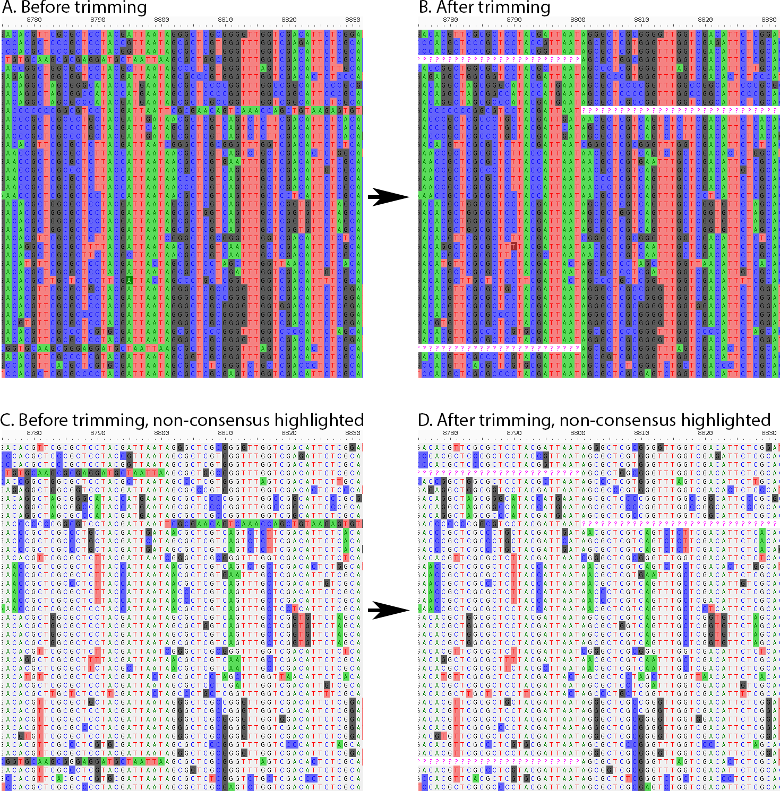

---
title: 'Spruceup: fast and flexible identification, visualization, and removal of outliers from large multiple sequence alignments'
tags:
  - Python
  - bioinformatics
  - alignment trimming
  - phylogenetics
  - orthology
authors:
  - name: Marek L. Borowiec
    orcid: 0000-0003-0872-7098
    affiliation: 1
affiliations:
 - name: Department of Entomology, Plant Pathology and Nematology, University of Idaho
   index: 1
date: 19 July 2019
bibliography: paper.bib
---

# Summary

``spruceup`` is an open-source Python software package that utilizes a novel algorithm and allows flexible identification, visualization, and removal of abnormal sequences by leveraging the large amount of data available in phylogenomic multiple sequence alignments (MSAs). The ``spruceup`` algorithm aims to solve the problem of individual poorly aligned sequences rarely addressed by other alignment trimming tools. It relies on computing distance metrics in a sliding window along an MSA and comparing them to metrics across all windows for each sample. While the program is designed with trimming phylogenetic datasets in mind, its output can be used for any task requiring computing of distances along MSAs with custom parameters.

Evolutionary inference is increasingly reliant on large MSAs consisting of millions of sites from hundreds or thousands of samples. MSAs used for inference of evolutionary relationships should contain homologous nucleotides or amino acids (alignment columns) from different samples (alignment rows). However, MSAs may contain errors that violate this assumption of homology, resulting from sample cross-contamination, incorrect orthology prediction, high divergence leading to insufficient information for accurate alignment, or other failures of alignment algorithms. These errors have been well-documented and shown to negatively impact phylogenetic inference. While many tools exist for trimming of poorly-aligned MSA columns, few allow identification of individual misaligned sequences. Tools for removal of poorly aligned columns address issues impacting most samples in the MSA but are not designed to identify misalignment limited to a single or few sequences (rows). Failure to remove such individual misaligned sequences introduces errors into downstream analyses. Lack of tools for automated detection of these sequences means that few researchers attempt manual alignment curation and many simply do not address them. Although visual inspection of data is always desirable, manual error correction is unsustainable with the alignment sizes used in modern phylogenetic studies. ``spruceup`` is intended to complement commonly used tools that filter poorly-aligned MSA sites to further improve alignment quality.

# Overview 

Evolutionary research relies on Multiple Sequence Alignments (MSAs) which are matrix representations of hypotheses about evolutionary history of genetic material. Rows in these matrices correspond to different samples, most often individual organisms representative of species or populations. The columns, which are called sites, contain nucleotides (in DNA and RNA sequences) or amino acids (in protein sequences) that should be homologous, meaning derived from the same ancestral nucleotide or amino acid in all included samples. Because of complexities of molecular evolution, aligning sequences such that they are homologous is a significant computational challenge [@morrison_2018multiple]. As a result, homology errors that have negative impact on downstream analyses, including phylogenetics and evolutionary inference [@ogden_2006msa], are widespread in currently published phylogenetic data [@philippe_2017; @springer_2018homology]. Recent studies show that dramatically different phylogenetic trees can be produced by altering a few regions or even sites in very large MSAs [@shen_2017contentious; @brown_2017bf; @walker_2018contentious]. Because of this, researchers often post-process MSAs following alignment to identify and filter out non-homologous matrix cells.

Many tools exist that trim alignments based on low-quality sites [@talavera_2007; @dress_2008noisy; @capella_gutierrez_2009trimal; @kuck_2010; @criscuolo_2010bmge; @penn_2010guidance; @wu_2012zorro]. These methods process MSAs on a column-by-column basis and can identify alignment blocks where many samples or OTUs are problematic but may not have the power to identify errors affecting only one or few of the samples.

Relatively few existing alignment trimming strategies have the ability to process data on a row-by-row basis and detect errors resulting from misalignment of one or few samples. An approach that has been successfully used in several phylogenomic studies uses information from phylogenetic trees inferred from individual locus or gene alignments to identify sequences that are subtended by unusually long branches [@yang_2014transcriptomes; @borowiec_2015ctenophora]. Unfortunately, this approach may disproportionately affect genuinely divergent sequences, such as distantly related outgroup taxa. A more sophisticated version of this idea, capable of taking into account divergent samples, is implemented in TreeShrink [@mai_2018treeshrink]. All tree-based approaches require phylogenetic analysis prior to and following alignment trimming, which may be computationally expensive.

Two recently developed methods aim to identify artifacts affecting only one or few samples directly from sequence alignments: HmmCleaner [@di_franco_2019hmmcleaner] and PREQUAL [@whelan_2018prequal]. Both tools build hidden Markov models of sequences within an alignment to identify poorly-aligned sequence fragments. They are designed to work with amino acid and protein-coding nucleotide sequences and are thus not suitable for some phylogenomic alignments, such as ones constructed from partially or largely non-coding ultraconserved elements [@faircloth_2012uces].

Finally, visual inspection of alignment followed by manual correction has been proposed to deal with alignment issues [@springer_2018homology]. Visual inspection of data is always desirable but it is unlikely to be used as a comprehensive error-removal strategy with alignments that now routinely include thousands of loci sequenced from dozens or even hundreds of samples [@edwards_2016].

The Python software package ``spruceup`` introduced here was designed to perform fast detection of outlier sequences and alignment trimming without prior phylogenetic analysis and without penalizing genuinely divergent sequences. It it is also capable of fine-scale alignment inspection that allows identification of errors affecting only parts of a locus or gene region. It fills a need for a user-friendly toolbox for flexible identification, visualization, and removal of individual misaligned sequence fragments from large multiple sequence alignments.

The workflow of outlier detection and removal is as follows: 

1. Split large phylogenomic alignment into windows of user-defined size and overlap.

2. Calculate genetic distances among taxa in each window; distances can optionally be scaled by distance derived from a guide tree.

3. Compute distribution of distances across windows for each OTU (Operational Taxonomic Unit that is defined as a single sequence representing an individual sample which is a representative of a population, species, or a higher taxon).

4. Fit a lognormal curve to distances observed for each OTU (optional).

5. Using a user-defined cutoff, reject samples from the tail of the distribution in each OTU. The cutoff can represent quantile of the fitted distribution or the mean of each OTU’s distances across windows. The cutoff defined this way varies across OTUs and ensures that genuinely divergent OTUs are not disproportionately affected (Figure 1).

6. Plot and visualize distribution of distances and cutoffs for each OTU.

``spruceup`` allows the user to calculate distances across alignment windows of arbitrary size and overlap. The resulting distances are written to a ``json`` format file. This distance output file can be later used for exploration of various outlier cutoff criteria and thresholds, or other applications where the user needs to know OTU-specific distances across the alignment. Given user-defined criteria, the removal procedure identifies outliers and records their alignment coordinates to a file. Distribution of distances across all alignment windows are visualized for each OTU along with thresholds chosen for trimming. The program can be used for outlier removal with variable amount of supervision, from trimming relying on default settings to assisted manual inspection of potentially erroneous regions.

# Availability and Implementation 

``spruceup`` is written in Python 3.7 and supported on Windows, Linux, and OSX operating systems. It is distributed under GNU GPLv3 license (https://www.gnu.org/licenses/gpl-3.0.en.html). It is available on and can be installed through the Python Package Index at (https://pypi.org/project/spruceup/). The source code, manual and tutorial are also available on GitHub: (https://github.com/marekborowiec/spruceup).

# Acknowledgements

I would like to thank Philip S. Ward (UC Davis) for testing and valuable feedback on ``spruceup``.

# Figure

.center[

.caption[
**Figure 1:** Outlier removal from multiple sequence alignment by ``spruceup``. Divergent (complemented) sequence fragments were introduced into a simulated nucleotide data matrix (left panels), then trimmed using the ``spruceup`` workflow (right panels). Alignments visualized with AliView: https://ormbunkar.se/aliview/.
]

]
